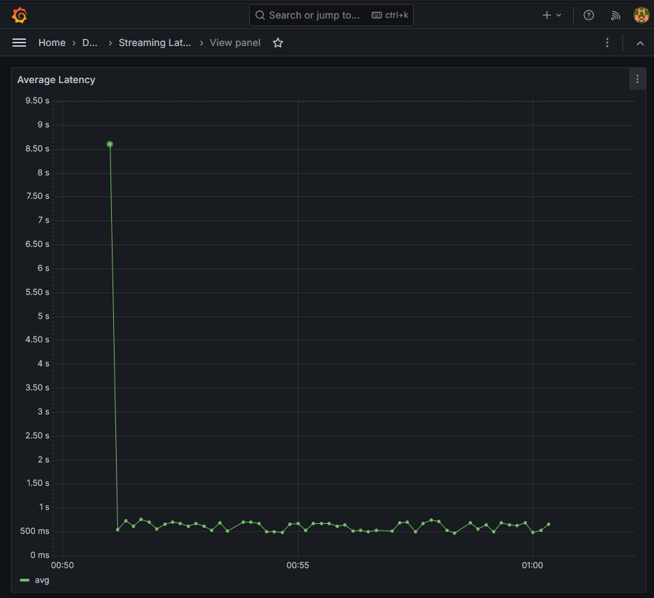
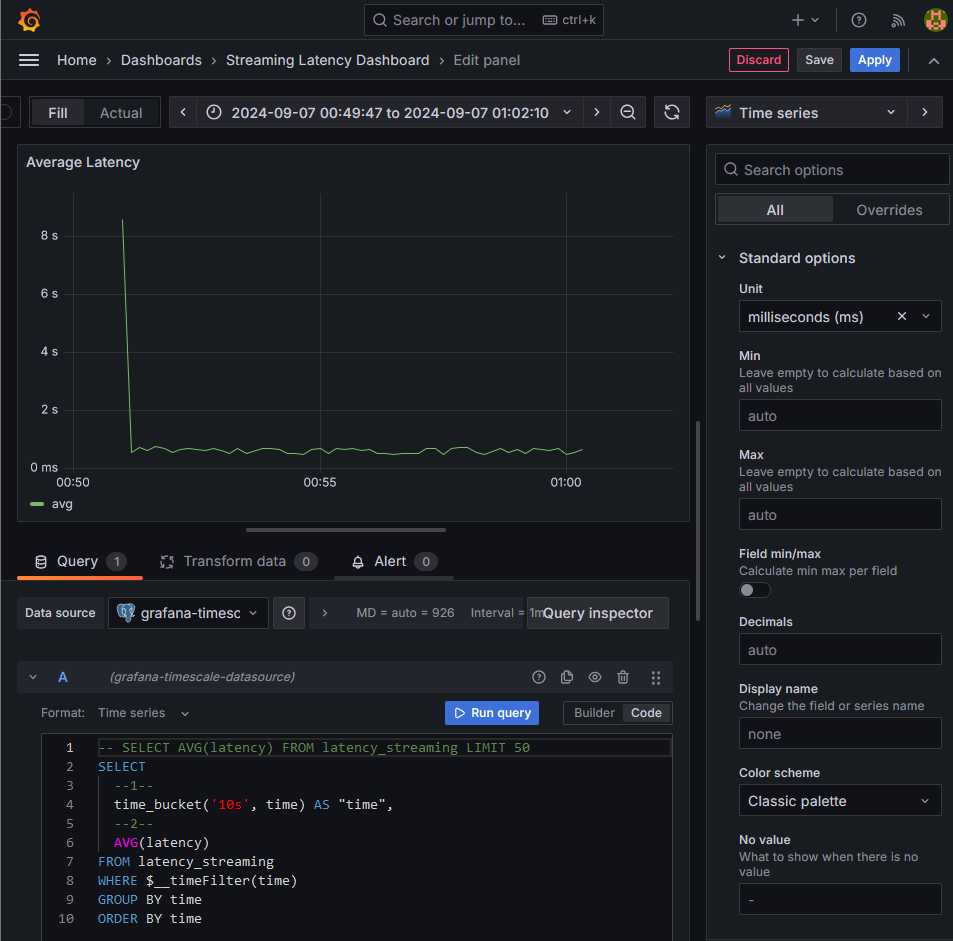

# Streaming End-to-End Latency Benchmarking
Tools to benchmark end-to-end latency of a stream processing pipeline using Kafka/Redpanda

## Setup for Benchmarking Apache Iceberg

### Components
- **A**: Adjustable workload generator
- **B**: Source topic (Kakfa compatible)
- **C**: Sink topic (Kafka compatible)
- **D**: Message matching and latency measurement
- **E**: Time-series database
- **F**: Latency monitoring dashboard

### Steps
1. Data generator and write generated data to `source-topic` Kafka topic
2. Streaming read from `source-topic` Kafka topic and streaming write to Iceberg table `kafka_topic`
3. Streaming read from Iceberg table `kafka_topic` and streaming write to `sink-topic` Kafka topic
4. Streaming read from `sink-topic` for message matching and latency measurement
5. Streaming read from `source-topic` for message matching and latency measurement
6. Streaming write latency measurement to time series database
7. Setup Dashboard to query database and visualize average latency over time

### TODO
- [x] Iceberg + Minio
- [x] Iceberg Catalog (Nessie)
- [x] Iceberg Query engine + Query UI (Dremio)
- [ ] Separate resources for streaming benchmark and streaming data pipeline framework (easier to reuse and compare between streaming solutions)
- [ ] Define resources in Kubernetes resources for better resource control, easier to scale up for testing higher workload, dynamically scale up/down resources for testing streaming pipeline behavior.
- [ ] Write script to automate process of spin up streaming benchmark resources.
- [ ] Write docs for end users to get started, customize, extend.

### Screenshots

#### Average latency dashboard

#### Setup dashboard

