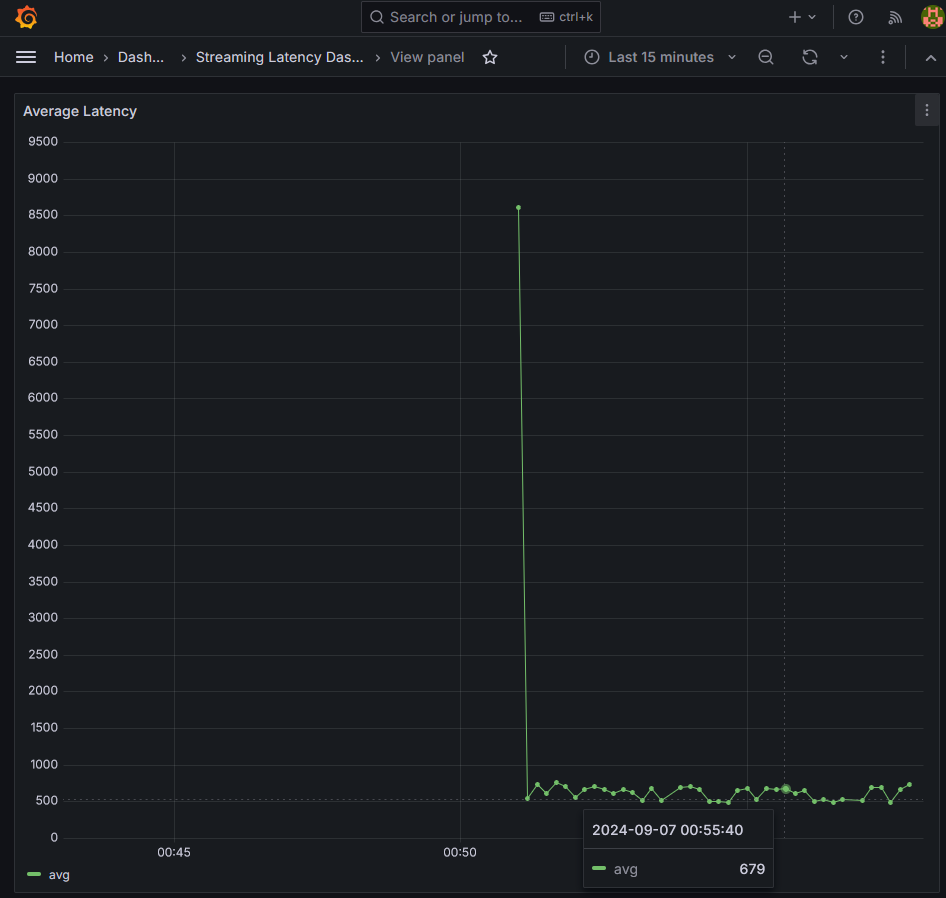
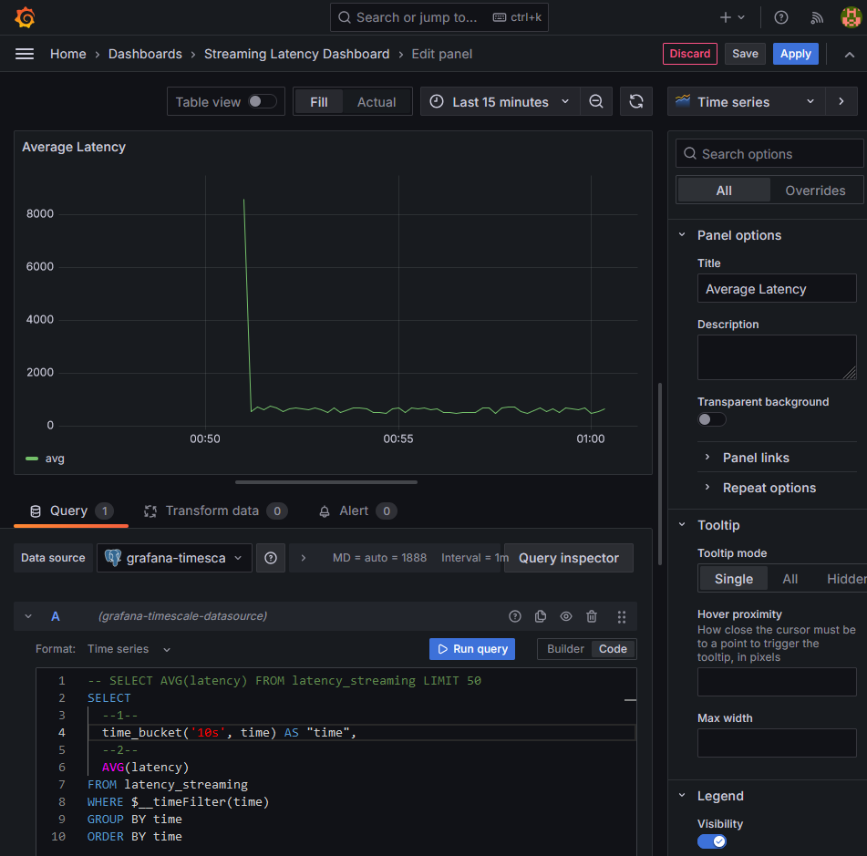

# Streaming End-to-End Latency Benchmarking
Tools to benchmark end-to-end latency of a stream processing pipeline using Kafka/Redpanda

## Setup for Benchmarking Apache Iceberg

### Steps
1. Data generator and write generated data to `source-topic` Kafka topic
2. Streaming read from `source-topic` Kafka topic and streaming write to Iceberg table `kafka_topic`
3. Streaming read from Iceberg table `kafka_topic` and streaming write to `sink-topic` Kafka topic
4. Streaming read from `sink-topic` for message matching and latency measurement
5. Streaming read from `source-topic` for message matching and latency measurement
6. Streaming write latency measurement to time series database
7. Setup Dashboard to query database and visualize average latency over time

### TODO
- [ ] Iceberg + Minio
- [ ] Iceberg Catalog
- [ ] Iceberg Query UI

### Screenshots

#### Average latency dashboard

#### Setup dashboard

